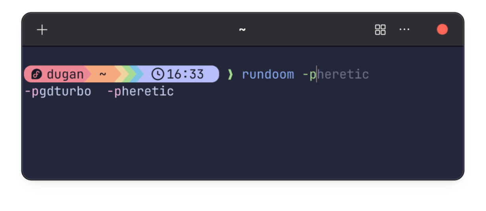
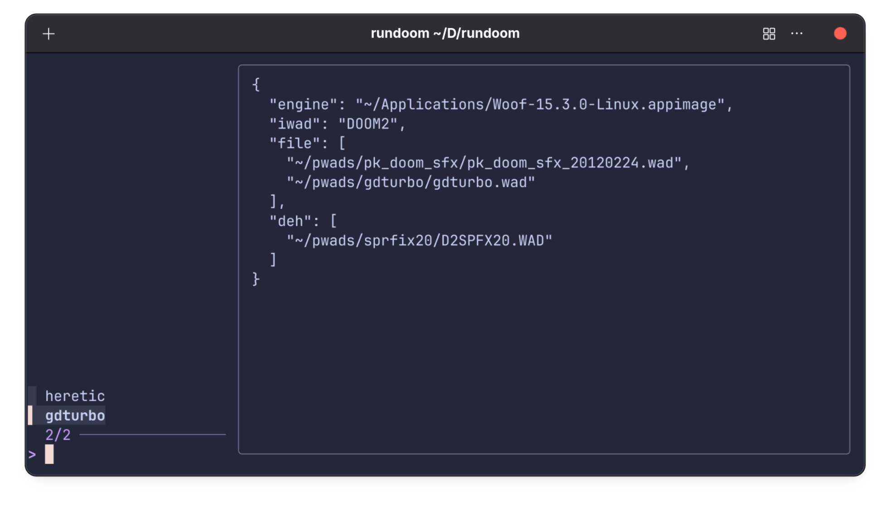

# RUNDOOM

A Classic-DOOM launcher for the FISH shell.

## Usage

I'm going to get myself set up to play the following:

Heretic with:
* [International Heretic](https://jnechaevsky.github.io/inter-doom/)
* [Heretic Minor Sprite Fixing and Widescreen-Friendly Project](https://www.doomworld.com/forum/topic/64778-heretic-minor-sprite-fixing-and-widescreen-friendly-project-v10-release/)

DOOM2 with 
* [Woof](https://fabiangreffrath.github.io/woof/)
* [Going Down Turbo](https://doomwiki.org/wiki/Going_Down:_Turbo)
* [The high resolution Doom sound effects pack](https://www.perkristian.net/game_doom-sfx.shtml)
* [Doom 2 Minor Sprite Fixing Project](https://www.doomworld.com/forum/topic/62403-doom-2-minor-sprite-fixing-project-v20-release-updated-112822/)

Using a powerful text editor that auto-completes file paths and supports json schemas (and using the
provided rundoompresets_schema.json), I translate that to the following json configuration file:

    {
        "heretic": {
            "engine": "/home/dugan/Applications/inter-heretic-8.3-linux.appimage",
            "file": [
                "/home/dugan/archives/pwads/HRSPFX10/HRSPFX10.WAD",
                "/home/dugan/archives/pwads/HRSPFX10/HRWIDE10.WAD"
            ]
        },
        "gdturbo": {
            "engine": "/home/dugan/Applications/Woof-15.3.0-Linux.appimage",
            "iwad": "DOOM2",
            "file": [
                "/home/dugan/archives/pwads/pk_doom_sfx/pk_doom_sfx_20120224.wad",
                "/home/dugan/archives/pwads/sprfix20/D2SPFX20.WAD",
                "/home/dugan/archives/pwads/gdturbo/gdturbo.wad"
            ],
            "deh": [
                "/home/dugan/archives/pwads/sprfix20/D2SPFX20.WAD"
            ]
        }
    }

(Variables and tildes are not supported for the paths; sorry).

The command-line format is:

    rundoom [-p <preset>] -- <any extra arguments>

The -p (preset) option is integrated with FISH's completion system. This is the intended way to use rundoom.

You'll notice that the next time you use rundoom, FISH will autocomplete the command to the last preset
you used.

Running *rundoom* without arguments gives you a picker. Looks cool, but really just an experiment that I threw in.

## Setup

Copy completions/rundoom.fish to ~/.config/fish/completions.

Copy bin/rundoom to a directory to ~/.local/bin, which you should have in your PATH.

Set the RUNDOOMPRESETS to be the path to the json file you're using for the presets. If the file is
~/Documents/rundoom/rundoompresets.json, then you do:

    set -x RUNDOOMPRESETS ~/Documents/rundoom/rundoompresets.json

## Requirements

* [jq](https://jqlang.org/)
* [fzf](https://junegunn.github.io/fzf/)
